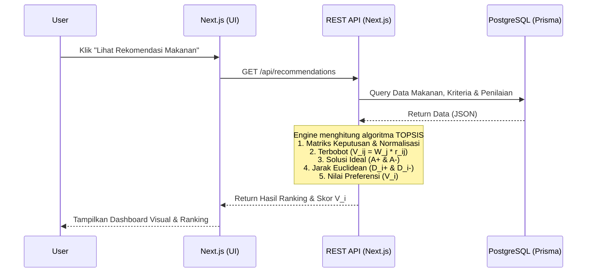
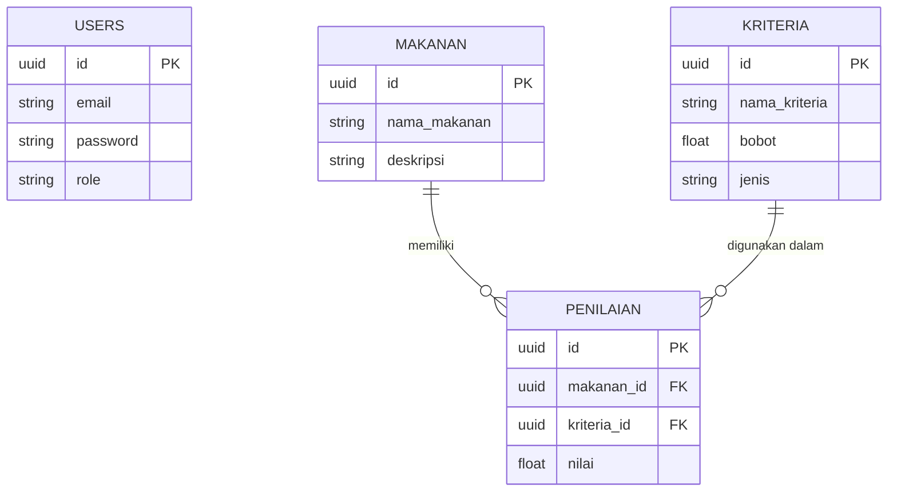

# PRD — Project Requirements Document

## 1. Overview
Orang dengan hipertensi dan ahli gizi sering kali kesulitan dalam merencanakan dan memilih menu makanan sehat setiap hari. Pasalnya, ada banyak faktor kompleks yang harus dipertimbangkan secara bersamaan, seperti kadar garam, protein, lemak, karbohidrat, dan cara pengolahan makanan. Saat ini, proses pemilihan sering dilakukan secara manual, melalui pencarian internet yang membingungkan, atau sekadar menebak-nebak tanpa dasar perhitungan yang jelas.

Aplikasi ini adalah **Sistem Pendukung Keputusan (SPK) berbasis web** yang dirancang untuk menyelesaikan masalah tersebut menggunakan metode perhitungan **TOPSIS**. Aplikasi ini akan menilai dan merangking berbagai pilihan makanan secara sistematis, objektif, dan transparan. Tujuannya adalah memberikan rekomendasi menu makanan terbaik secara cepat, sehingga penderita hipertensi dapat menjaga kesehatannya dengan lebih mudah dan praktis tanpa harus repot melakukan perhitungan manual.

Untuk memastikan *Time-to-Value* yang instan, sistem akan dilengkapi dengan **data awal (seed data)** berdasarkan studi kasus validasi jurnal, menampilkan contoh ranking nyata seperti **Kentang Kukus** (Nilai $V_i$: 0.6654), **Bubur Kacang Hijau** (Nilai $V_i$: 0.6373), dan **Kacang Merah** (Nilai $V_i$: 0.6013) sebagai referansi awal agar pengguna langsung memahami manfaat dan akurasi rekomendasi sistem.

## 2. Requirements
- **Berbasis Web Responsif:** Aplikasi dapat diakses dengan nyaman melalui perangkat desktop (PC/Laptop) maupun mobile (Smartphone).
- **Akurasi Algoritma:** Sistem harus mampu merespons dan menghitung ranking makanan secara akurat menggunakan rumus algoritma TOPSIS yang standar, dengan validasi terhadap nilai preferensi ($V_i$).
- **Time-to-Value Cepat:** Pada saat login pertama kali, pengguna harus langsung dapat mensimulasikan atau melihat hasil rekomendasi makanan terbaik, agar mereka langsung memahami manfaat aplikasi.
- **Arsitektur Relasional:** Menggunakan konsep REST API untuk komunikasi data dan database relasional untuk menjaga integritas data (makanan, kriteria, dan nilai).
- **Penggunaan Berulang:** Sistem harus memungkinkan penyesuaian kriteria atau menu baru secara dinamis, sehingga relevan untuk dikunjungi setiap hari saat pengguna butuh inspirasi menu.
- **Validasi Jurnal & Standar Klinis:** Semua kriteria, bobot, dan skala penilaian harus mengikuti standar yang telah divalidasi dalam penelitian medis dan jurnal acuan (Puskesmas Belimbing Kota Padang).

## 3. Core Features
- **Autentikasi & Login:** Sistem login yang aman untuk mengelola hak akses pengguna (misalnya peran Admin/Ahli Gizi dan Pengguna Biasa/Pasien).
- **Dashboard & Visualisasi Hasil:** Halaman utama yang menampilkan ringkasan data makanan dan visualisasi grafis dari hasil perhitungan preferensi ($V_i$).
- **Manajemen Kriteria & Bobot:** Fitur untuk mengelola 5 parameter inti penilaian dengan bobot skala 1-5:
  1. **Karbohidrat** (Atribut: Benefit, Bobot: 2) - Sumber energi tubuh.
  2. **Protein** (Atribut: Benefit, Bobot: 4) - Memperbaiki jaringan sel.
  3. **Lemak** (Atribut: Benefit, Bobot: 3) - Sumber energi tinggi.
  4. **Pengolahan** (Atribut: Benefit, Bobot: 5) - Faktor terpenting dalam penilaian keamanan.
  5. **Garam** (Atribut: Cost, Bobot: 4) - Faktor risiko pemicu hipertensi.
- **Manajemen Data Makanan:** Direktori untuk mencatat daftar menu makanan yang tersedia beserta deskripsi nutrisinya.
- **Input Penilaian Makanan:** Fitur untuk memasukkan nilai gizi dan skor spesifik (skala 1-5) dari setiap makanan terhadap kriteria terkait. Sistem menyediakan bantuan input berupa:
  - *Pengolahan:* Digoreng (1), Dibakar (2), Ditumis (3), Direbus (4), Dikukus (5).
  - *Garam (per 100gr):* 4-5gr (1), 3-4gr (2), 2-3gr (3), 1-2gr (4), 0-1gr (5).
- **Perhitungan Engine TOPSIS:** Modul sistem yang mengolah data penilaian mentah menjadi skor relasional menggunakan metode TOPSIS secara otomatis dengan tahapan:
  1. **Membangun Matriks Keputusan:** Mengumpulkan nilai performansi setiap alternatif menu berdasarkan kriteria.
  2. **Normalisasi Matriks:** Mengubah nilai matriks asli menjadi matriks ternormalisasi ($r_{ij}$).
  3. **Matriks Ternormalisasi Terbobot:** Mengalikan matriks ternormalisasi dengan bobot kriteria ($V_{ij} = W_j \cdot r_{ij}$).
  4. **Menentukan Solusi Ideal:** Mencari Solusi Ideal Positif ($A^+$) dan Solusi Ideal Negatif ($A^-$) berdasarkan jenis atribut (Benefit/Cost).
  5. **Menghitung Jarak Euclidean:** Mengukur jarak setiap alternatif ke solusi ideal positif ($D_i^+$) dan negatif ($D_i^-$).
  6. **Menentukan Nilai Preferensi ($V_i$):** Menghitung kedekatan relatif setiap alternatif. Nilai $V_i$ yang lebih tinggi (mendekati 1) menunjukkan alternatif yang lebih baik dan direkomendasikan.
- **Laporan Hasil Ranking:** Menampilkan daftar rekomendasi makanan dari urutan terbaik hingga terburuk, lengkap dengan skor $D_i^+$, $D_i^-$, dan nilai preferensi $V_i$ yang transparan.

## 4. User Flow
1. **Login:** Pengguna masuk ke dalam aplikasi menggunakan kredensial mereka.
2. **Setup Data (Oleh Admin/Ahli Gizi):** Memasukkan data Kriteria, daftar Makanan, dan memberikan Penilaian (skor 1-5) untuk setiap makanan pada kriteria tersebut sesuai skala baku.
3. **Minta Rekomendasi & Lihat Seed Data:** Pengguna masuk ke menu "Rekomendasi Makanan". Pada tampilan pertama atau mode demo, sistem langsung memuat simulasi ranking berdasarkan data awal (seed) seperti Kentang Kukus, Bubur Kacang Hijau, dan Kacang Merah untuk demonstrasi nilai aplikasi.
4. **Proses TOPSIS:** Sistem secara otomatis memproses data yang ada melalui REST API dan menjalankan 6 langkah metode TOPSIS (Normalisasi, Terbobot, Solusi Ideal, Jarak Euclidean, hingga Nilai Preferensi).
5. **Lihat Hasil:** Pengguna disajikan tabel atau grafik berisi ranking makanan dari yang paling sehat direkomendasikan hingga yang paling dibatasi, lengkap dengan nilai skor akhir $V_i$.
6. **Aksi:** Pengguna memilih makanan ranking #1 untuk menu harian mereka dan dapat kembali keesokan harinya untuk melihat kombinasi lain atau meminta perhitungan ulang dengan data baru.

## 5. Architecture
Sistem ini menggunakan arsitektur *Client-Server* modern. Frontend Next.js akan berkomunikasi dengan Backend Next.js API Routes (REST API), yang kemudian akan melakukan query ke database PostgreSQL melalui Prisma ORM. Perhitungan TOPSIS akan dieksekusi di sisi server (Backend) untuk memastikan data tidak dimanipulasi, rumus tetap standar, dan proses berjalan cepat.

## 6. Database Schema
Untuk menjalankan metode TOPSIS, dibutuhkan database relasional. Berikut adalah struktur utama dari entitas yang dibutuhkan:

- **Users:** Menyimpan data pengguna aplikasi.
  - `id` (UUID, Primary Key)
  - `email` (String, Unique)
  - `password` (String)
  - `role` (String) - Penentu hak akses (Admin/User)
- **Kriteria:** Menyimpan parameter penilaian (Garam, Protein, dll).
  - `id` (UUID, Primary Key)
  - `nama_kriteria` (String)
  - `bobot` (Float) - Tingkat kepentingan kriteria (Skala 1-5)
  - `jenis` (String) - Penanda jenis kriteria ('Benefit' atau 'Cost')
- **Makanan:** Menyimpan daftar menu makanan.
  - `id` (UUID, Primary Key)
  - `nama_makanan` (String)
  - `deskripsi` (String, Opsional)
- **Penilaian:** Tabel relasi (junction) yang menyimpan nilai suatu makanan pada kriteria tertentu.
  - `id` (UUID, Primary Key)
  - `makanan_id` (UUID, Foreign Key)
  - `kriteria_id` (UUID, Foreign Key)
  - `nilai` (Float) - Skor aktual makanan tersebut pada kriteria terkait

**Referensi Konversi Skala Penilaian (Dokumentasi Bisnis):**
- `kriteria_id` terkait **Pengolahan** akan memetakan nilai `nilai` sebagai: 1=Digoreng, 2=Dibakar, 3=Ditumis, 4=Direbus, 5=Dikukus.
- `kriteria_id` terkait **Garam** akan memetakan nilai `nilai` sebagai: 1=(4-5)gr/100gr, 2=(3-4)gr/100gr, 3=(2-3)gr/100gr, 4=(1-2)gr/100gr, 5=(0-1)gr/100gr.

## 7. Tech Stack
Sesuai dengan kebutuhan inti proyek, berikut adalah kombinasi teknologi yang direkomendasikan untuk pengembangan sistem secara optimal:

- **Frontend:** Next.js (App Router), Tailwind CSS (untuk styling yang cepat dan responsif), shadcn/ui (untuk komponen antarmuka yang bersih dan mudah digunakan).
- **Backend/API:** Next.js Route Handlers (bertindak sebagai backend REST API untuk mengelola logika bisnis dan kalkulasi rumus TOPSIS).
- **Database ORM:** Prisma (memberikan integrasi *type-safe* yang sangat baik dengan TypeScript).
- **Database Engine:** PostgreSQL (database relasional yang handal dan stabil).
- **Autentikasi:** NextAuth.js atau Better Auth (pengelolaan sesi login yang aman).
- **Deployment:** Vercel (untuk *hosting* Frontend dan API serverless), Neon DB / Supabase (untuk *hosting* database PostgreSQL secara cloud).

## 8. API Documentation
Bagian ini mendokumentasikan endpoint REST API yang digunakan untuk manajemen data inti dan eksekusi algoritma TOPSIS. Semua endpoint memerlukan header `Authorization: Bearer <token>` kecuali yang ditandai sebagai publik.

### 8.1 Autentikasi
| Method | Endpoint | Deskripsi | Request Body | Response (200 OK) |
|:---|:---|:---|:---|:---|
| POST | `/api/auth/login` | Login pengguna & dapatkan token JWT | `{ email, password }` | `{ token, user: { id, email, role } }` |
| POST | `/api/auth/register` | Registrasi akun baru (hanya Admin) | `{ email, password, role }` | `{ user: { id, email, role } }` |
| POST | `/api/auth/refresh` | Refresh token JWT yang kadaluarsa | `{ refreshToken }` | `{ token, refreshToken }` |

### 8.2 Manajemen Kriteria
| Method | Endpoint | Deskripsi | Request Body | Response (200 OK) |
|:---|:---|:---|:---|:---|
| GET | `/api/kriteria` | Ambil semua parameter kriteria | - | `[{ id, nama_kriteria, bobot, jenis }]` |
| POST | `/api/kriteria` | Tambah kriteria baru | `{ nama_kriteria, bobot, jenis }` | `{ id, nama_kriteria, bobot, jenis }` |
| PUT | `/api/kriteria/:id` | Update kriteria | `{ nama_kriteria, bobot, jenis }` | `{ id, nama_kriteria, bobot, jenis }` |
| DELETE | `/api/kriteria/:id` | Hapus kriteria | - | `{ message: "Berhasil dihapus" }` |

### 8.3 Manajemen Makanan & Penilaian
| Method | Endpoint | Deskripsi | Request Body | Response (200 OK) |
|:---|:---|:---|:---|:---|
| GET | `/api/makanan` | Daftar semua menu makanan | - | `[{ id, nama_makanan, deskripsi }]` |
| POST | `/api/makanan` | Tambah menu baru | `{ nama_makanan, deskripsi? }` | `{ id, nama_makanan, deskripsi }` |
| POST | `/api/penilaian/bulk` | Input skor penilaian massal | `{ makanan_id, penilaian: [{ kriteria_id, nilai }] }` | `{ message: "Penilaian tersimpan" }` |
| GET | `/api/penilaian?makananId=xxx` | Ambil detail penilaian makanan | - | `[{ kriteria: {...}, nilai }]` |

### 8.4 TOPSIS & Rekomendasi
| Method | Endpoint | Deskripsi | Request Body | Response (200 OK) |
|:---|:---|:---|:---|:---|
| GET | `/api/recommendations` | Ambil ranking makanan terbaru | - | `[{ id, nama, nilai_vi, di_plus, di_minus }]` |
| POST | `/api/topsis/calculate` | Trigger eksekusi ulang TOPSIS | `{ filter? }` (opsional) | `{ status: "success", results: [...] }` |
| GET | `/api/topsis/logic` | Lihat detail perhitungan & seed data | - | `{ steps: [...], seed_examples: [...] }` |

**Catatan Konvensi:**
- Format Response Error: `{ "error": "Deskripsi kesalahan", "code": "ERR_XXX" }`
- Semua nilai `nilai_vi` di-normalisasi antara 0.0 hingga 1.0. Semakin mendekati 1.0, semakin direkomendasikan.
- Rate limiting diterapkan: 60 permintaan/menit per IP untuk endpoint publik, 120 untuk endpoint autentikasi.

## 9. Dokumen Arsitektur Teknis
Dokumen ini menjelaskan rancangan teknis sistem secara mendalam, mencakup komponen utama, strategi keamanan, alur data, serta pertimbangan skalabilitas.

### 9.1 Komponen Sistem
1. **Frontend (Presentation Layer)**
   - **Framework:** Next.js 14+ (App Router) dengan TypeScript.
   - **State & Data Fetching:** React Query (TanStack Query) untuk caching, optimasi fetch, dan sinkronisasi data secara reaktif. Zustand untuk state manajemen lokal (UI/Theme).
   - **UI Component:** shadcn/ui + Tailwind CSS untuk desain sistematis, responsif, dan mudah dikustomisasi.
   - **Visualisasi:** Recharts atau Chart.js untuk grafik radar/donut distribusi nilai $V_i$ dan perbandingan kriteria.

2. **Backend (Logic & API Layer)**
   - **Runtime:** Next.js API Routes (Node.js Serverless Functions). Setiap endpoint diisolasi dan dapat di-scale secara independen.
   - **Business Logic:** Modul `TOPSEngine.ts` yang mengimplementasikan 6 langkah metode TOPSIS secara deterministik. Logika ini bersifat *pure function* untuk kemudahan testing dan debugging.
   - **ORM:** Prisma Client untuk query database yang type-safe, mencegah SQL injection, dan mengelola relasi kompleks antar tabel.
   - **Validation:** Zod atau Superstruct untuk validasi input payload sebelum diproses lebih lanjut.

3. **Database (Storage Layer)**
   - **Engine:** PostgreSQL 15+. Dipilih karena konsistensi ACID, dukungan JSONB (jika perlu ekstensi metadata), dan kompatibilitas tinggi dengan Prisma.
   - **Indexing:** 
     - Index pada `penilaian(makanan_id, kriteria_id)` untuk join cepat.
     - Index pada `kriteria(jenis)` dan `bobot` untuk query matriks keputusan.
   - **Seeding:** Script `prisma db seed` yang otomatis memuat 5 kriteria standar, 3 makanan seed (Kentang Kukus, Bubur Kacang Hijau, Kacang Merah), beserta nilai penilaiannya sesuai jurnal saat migrasi awal.

### 9.2 Strategi Keamanan
- **Autentikasi & Sesi:** NextAuth.js atau Better Auth dengan penyedia **JWT (JSON Web Token)** terenkripsi. Token disimpan dalam HTTP-only Secure Cookies untuk mencegah akses XSS.
- **Otorisasi (RBAC):** Middleware pemeriksaan `role` di setiap route API. Admin memiliki akses penuh (`CRUD`), sedangkan User/Pasien hanya dapat melakukan `READ` dan akses rekomendasi.
- **Password Handling:** Hash password menggunakan `bcrypt` atau `@node-rs/bcrypt` dengan salt rounds minimal 10. Password tidak pernah dikembalikan dalam response API.
- **Proteksi API:** CORS whitelist (hanya domain frontend yang diizinkan), Rate Limiting, dan input sanitization terhadap payload POST/PUT.
- **Enkripsi Data Sensitif:** Environment variables untuk connection string, secret key, dan JWT secret. Tidak ada kredensial yang ter-commit ke repository (menggunakan `.env.example`).

### 9.3 Alur Data (Data Flow)
1. **Inisialisasi Request:** Pengguna mengklik tombol "Hitung Rekomendasi" di Frontend.
2. **Validasi Sesi:** Middleware Next.js memeriksa keberadaan dan validitas token JWT. Jika valid, payload decoded diteruskan ke handler.
3. **Ekstraksi Data:** Backend memanggil Prisma ORM untuk menarik semua entri `Makanan`, `Kriteria`, dan `Penilaian` yang aktif. Query dioptimasi menggunakan `include` untuk join data dalam satu transaksi.
4. **Eksekusi TOPSIS:** 
   - Backend menyusun matriks keputusan dari data mentah.
   - Jalankan fungsi `calculateTopsis(criteria, bobot, dataMakanan)`.
   - Hasil perhitungan (ranking array) dikembalikan ke Frontend.
5. **Caching & Penyajian:** Frontend menerima payload, mengupdate cache React Query, dan merender ulang komponen ranking. Data juga dapat di-cache di sisi server (ISR/Edge Cache) selama 1 jam untuk mengurangi beban DB jika data tidak berubah.
6. **Sinkronisasi Admin:** Jika Admin mengubah bobot atau menambah makanan baru, webhook atau manual cache invalidation memicu reset cache rekomendasi, memastikan hasil selalu update.

### 9.4 Skalabilitas & Observabilitas
- **Horizontal Scaling:** Frontend & API di-deploy ke Vercel yang secara otomatis menangani scaling serverless berdasarkan Traffic/Concurrency.
- **Database Scaling:** Neon DB / Supabase menyediakan fitur connection pooling (PgBouncer), read replicas, dan auto-scaling storage.
- **Monitoring:** Integrasi Sentry untuk error tracking real-time, dan Vercel Analytics / Log Drains untuk memantau latency endpoint API & error rate.
- **Backup & Disaster Recovery:** Snapshot database otomatis harian (retensi 7 hari). Export/Import data JSON tersedia di panel Admin untuk arsip manual.

### 9.5 Lingkungan Pengembangan & Deployment
| Lingkungan | Tujuan | Hosting |
|:---|:---|:---|
| `Development` | Coding unit, lokakarya frontend/backend | Localhost + Docker Compose (Postgres) |
| `Staging` | UAT, validasi algoritma TOPSIS, QA | Vercel Preview / Staging Branch |
| `Production` | Live deployment ke publik/RS/Puskesmas | Vercel (App) + Neon DB (Database) |

Dokumen ini berfungsi sebagai acuan teknis utama bagi tim pengembang dan arsitek sistem. Setiap perubahan pada skema database atau logika TOPSIS wajib diikuti dengan update migrasi Prisma dan regression testing terhadap seed data jurnal.